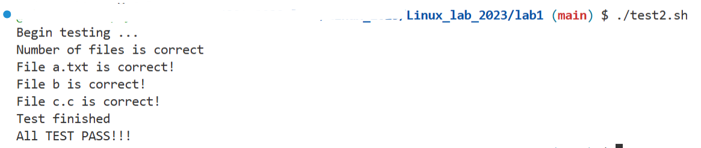

# Linux 2023 Lab

Hello! This is our lab. Please download the code by

`git clone https://github.com/Yiyi-philosophy/Linux_lab_2023`

and run in linux system.

## Lab 1

Copy `a.txt` `b` `c.c` files from `org` to `src .`

We hope that file in `src` is like this:

- `a.txt`

  - Content: "Welcome"
- `b`

  - Content: "to"
- `c`

  - Content: "Linux 2023"

You can use `./test.sh` to vertify your answer.

If you meet the problem "Permission Denied", use `chmod 755 test.sh` .

